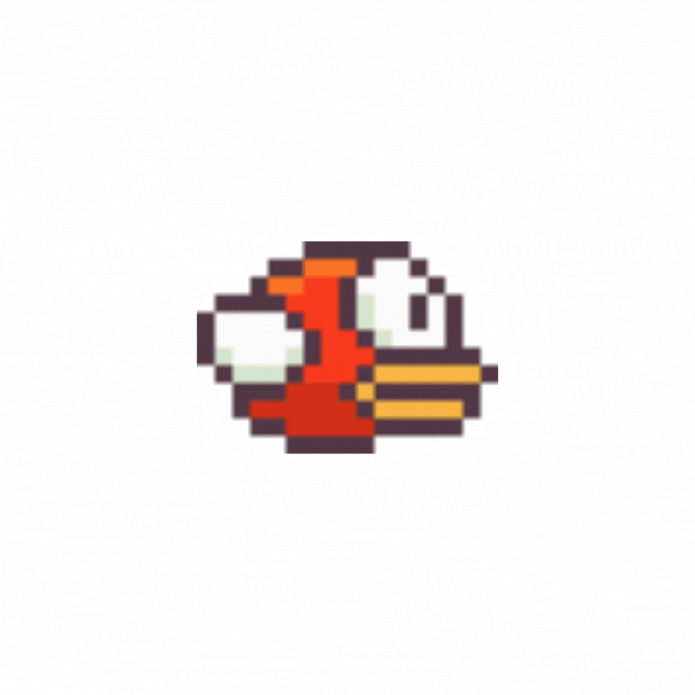

# 🐦 FlappyBird 🐦

Una versión del mundialmente conocido videojuego FlappyBird hecho con Python.

## Cómo jugar:

Haz clic en el ratón para que el pajarito vuele. ¡Solo eso!

### Fin del juego?

Si has perdido, haz clic en el botón _RESTART_ para volver al comienzo del juego.

## ¡Buen juego!

Te deseo toda la suerte del mundo. ¡Intenta jugar tantas veces como quieras!

  

